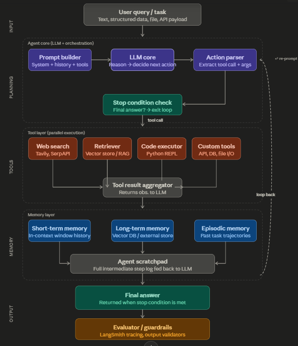
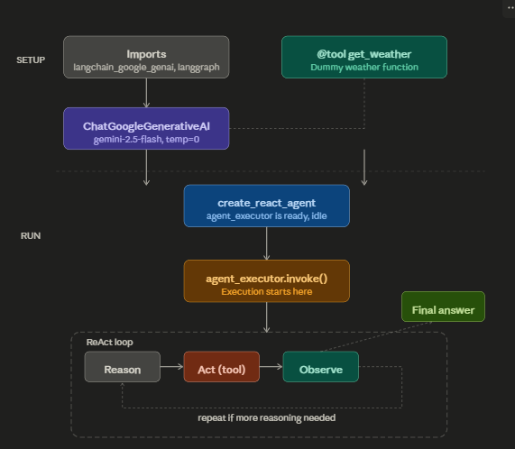

# UV PACKAGE MANAGER
uv is a modern Python package and environment manager developed by Astral. It is written in Rust, which makes it significantly faster than traditional Python tools such as pip, virtualenv, and pip-tools.

The main goal of uv is to provide a single tool for:

Creating virtual environments
Installing and managing dependencies
Locking dependency versions
Managing Python versions
Running Python scripts and projects

<!-- ADK -->
AI Studio
    ↓
Test prompts
    ↓
Generate Python code
    ↓
Build agent with ADK/LangGraph
    ↓
Deploy on Vertex AI or your server

##ASGI
Browser
   ↓
Uvicorn
   ↓
ASGI
   ↓
FastAPI

ASGI supports:

async/await
WebSockets
Long-lived connections
High concurrency

## Streaming
Streaming is when you send response in small chunks instead of all at once.

## DEEP AGENTS
Deep agents in LangChain — here's a full breakdown, with a visual architecture to anchor it.

What are deep agents in LangChain? The term "deep agents" typically refers to LangChain agents that operate with extended reasoning loops — using long chains of tool calls, memory, and planning steps to solve complex, multi-step tasks rather than responding in a single shot. They're "deep" in the sense that they traverse many reasoning and action steps before arriving at a final answer.

| Method      | Input                     | Output          |
| ----------- | ------------------------- | --------------- |
| `invoke()`  | One prompt                | One response    |
| `stream()`  | One prompt                | Response chunks |
| `batch()`   | Many prompts              | Many responses  |
| `ainvoke()` | One prompt (async)        | One response    |
| `abatch()`  | Many prompts (async)      | Many responses  |
| `astream()` | One prompt (async stream) | Response chunks |
